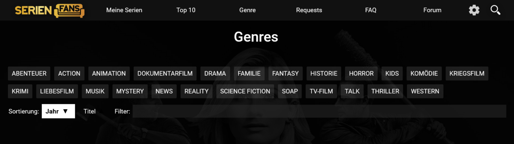

# Sortieren von Genres bei SerienFans und FilmFans

Erweitert die Genres von SerienFans und FilmFans um die möglichkeit nach Jahr oder Titel zu sortieren und nach Titel zu filtern

## Installation

1. Zuerst benötigen Sie eine Browser-Erweiterung zum Verwalten von Benutzerskripten (überspringen Sie diesen Schritt, wenn Sie bereits eine haben):
  
   * Chrome: [Violentmonkey](https://chrome.google.com/webstore/detail/violentmonkey/jinjaccalgkegednnccohejagnlnfdag) oder [Tampermonkey](https://chrome.google.com/webstore/detail/tampermonkey/dhdgffkkebhmkfjojejmpbldmpobfkfo)
   * Firefox: [Violentmonkey](https://addons.mozilla.org/en-US/firefox/addon/violentmonkey/), [Tampermonkey](https://addons.mozilla.org/en-US/firefox/addon/tampermonkey/) oder [Greasemonkey](https://addons.mozilla.org/en-US/firefox/addon/greasemonkey/) 
   * Opera: [Tampermonkey](https://addons.opera.com/en/extensions/details/tampermonkey-beta/)
   * Brave: [Violentmonkey](https://chrome.google.com/webstore/detail/violentmonkey/jinjaccalgkegednnccohejagnlnfdag) oder [Tampermonkey](https://chrome.google.com/webstore/detail/tampermonkey/dhdgffkkebhmkfjojejmpbldmpobfkfo)
   * Edge: [Violentmonkey](https://microsoftedge.microsoft.com/addons/detail/violentmonkey/eeagobfjdenkkddmbclomhiblgggliao) oder [Tampermonkey](https://microsoftedge.microsoft.com/addons/detail/tampermonkey/iikmkjmpaadaobahmlepeloendndfphd)  
    

2. Installieren Sie das Skript von [dieser Seite](https://github.com/Meldo-Megimi/SerienFans/raw/master/main.user.js)

